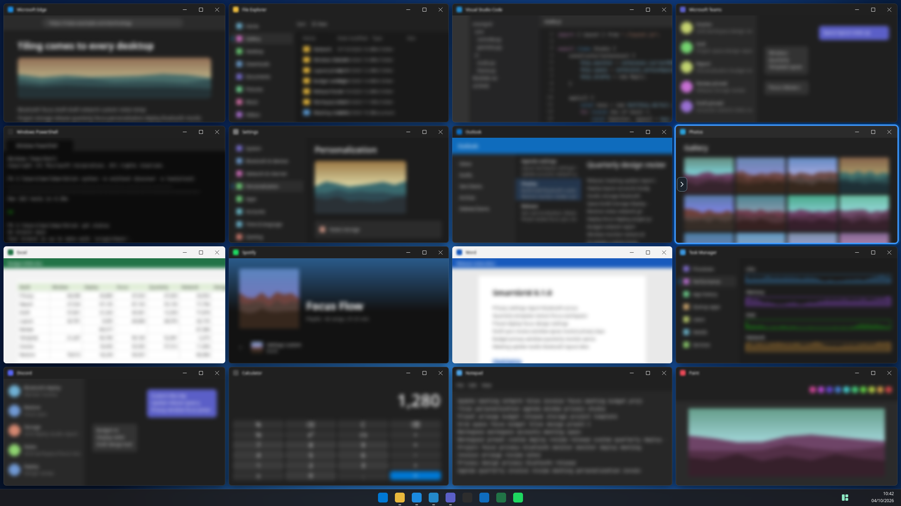

<div align="center">

# SmartGrid

**Your windows, beautifully arranged — on Windows.**

Automatic window tiling for **Windows 10 / 11**.

[](LICENSE)
[](#install)
[](requirements.txt)

**One shortcut to arrange. One shortcut to give your desktop back.**

</div>



SmartGrid is a tray application written in Python with Qt (PySide6) and the native Win32/DWM APIs. It starts paused: launching it does not rearrange your windows.

## What it does

- **Automatic layouts:** full, split, 60/40 focus-and-stack, and grid presets through 5×5. Classic layouts grow and shrink automatically, and can expand beyond 25 slots.
- **Layout Studio:** an overlay with application icons, numbered slots, drag-to-swap, layout presets, display/space selection, and a window library for assigning windows across displays. Create a named layout from a built-in preset or design custom tiles with splits, merges and percentage dimensions. Edit saved templates or the current space. Edits stay in a draft until applied or saved. **Window previews** shows live DWM thumbnails in the tiles.
- **Quick layout switcher:** open it from the tray menu or press Ctrl+Alt+L. See how many windows each saved layout will reuse, open, or hide before applying it to the focused display and space. Arrange open windows automatically without opening apps.
- **Drag to snap:** move a tiled window by its title bar, see the translucent target with *Swap · App* or *Move here*, and release. Same-display drops swap; cross-display drops insert and reflow both displays.
- **Directional focus:** press Ctrl+Alt+arrow to activate a neighboring tiled window without moving it.
- **Linked tile resize:** drag a shared window edge to resize neighboring tiles, continuing into further tiles when a neighbor reaches its minimum size. Proportions are kept for that display, space and window count. Arrange again (Ctrl+Alt+R) resets them.
- **Three spaces per display:** independent window groups within each Windows virtual desktop. Switching parks windows with native minimization; stopping reveals and restores them.
- **Force into tiles:** windows that refuse to be resized get a resizable frame and are sized into their tile. Original window styles are restored when tiling stops.
- **Stay in control:** floating windows, per-app rules, configurable compaction, maximize/fullscreen freeze, a focused-window outline that follows the Windows accent color, a window action palette (float, minimize, maximize, close), animated guides, and ten-level arrangement undo.
- **Pinned slots:** a card marks a reserved tile when its app is minimized, floating, or closed. Click it to restore, retile, or reopen the app.
- **Tray menu:** status, **Arrange windows**, one submenu per display with its three spaces, focused-window actions (float, swap, undo, redo), **Arrange again**, **Change layout…**, **Layout Studio…**, **Preferences** and **Stop and restore windows**. The **Windows tools** submenu adds **Open Windows Recycle Bin** and **Quit and restore windows**.
- **Import and export:** save named layouts and per-space profiles as a JSON file from Preferences, then import them on another installation without replacing existing ones.

## Install

Requires Windows 10 or 11 and [Python 3.11 or later for Windows](https://www.python.org/downloads/windows/).

1. Download or clone this repository.
2. Double-click **`smartgrid.bat`**. On first run it creates a `.venv`, installs PySide6 and Pillow (a few minutes, Internet required), adds a **SmartGrid** shortcut to the Desktop, and starts SmartGrid.
3. From then on, start SmartGrid from the **Desktop shortcut**. It runs without a console; its icon appears in the notification area (on Windows 11 it may be behind the **^** arrow of the taskbar).

Open the tray icon, or press **Ctrl+Alt+T** to begin arranging. **Ctrl+Alt+P** opens Layout Studio. Stop with **Ctrl+Alt+Q** to restore the original window geometry.

Notes:

- `smartgrid.bat` is the installer and repair tool. It reuses an existing Windows `.venv` and installs only missing or incompatible dependencies. A `.venv` created on another OS is reported and must be deleted.
- Keep `smartgrid.bat` next to `smartgrid.py`. If the Desktop shortcut is deleted, delete `.venv\.smartgrid-shortcut-v3` and run `smartgrid.bat` again to recreate it.
- Running `smartgrid.bat` from a network share (`\\server\...`) prints a harmless cmd warning about UNC paths; the Desktop shortcut does not.
- Starting SmartGrid while it is already running shows a message instead of a second instance.

Manual installation, from a command prompt in the project folder:

```bat
py -3 -m venv .venv
.venv\Scripts\python -m pip install -r requirements.txt
.venv\Scripts\pythonw smartgrid.py
```

Settings, profiles, saved layouts and the log (`smartgrid.log`) are stored in `%LOCALAPPDATA%\SmartGrid`. To remove SmartGrid, choose **Windows tools → Quit and restore windows** in the tray menu, then delete the project folder, the Desktop shortcut and `%LOCALAPPDATA%\SmartGrid`.

## Shortcuts

All shortcuts can be changed or disabled in Preferences. A shortcut must include Ctrl, Alt or Win.

| Shortcut | Action |
|---|---|
| Ctrl+Alt+T | Start / stop tiling and restore |
| Ctrl+Alt+P | Layout Studio |
| Ctrl+Alt+L | Change layout |
| Ctrl+Alt+R | Arrange again and reset manually resized tile proportions |
| Ctrl+Alt+F | Float / tile the focused window |
| Ctrl+Alt+S | Enter / leave swap mode |
| Ctrl+Alt+← / → / ↑ / ↓ | Focus the tiled window to the left / right / above / below |
| Ctrl+Alt+Z | Undo the last arrangement |
| Ctrl+Alt+Y | Redo the last undone arrangement |
| Ctrl+Alt+1 / 2 / 3 | Switch space on the focused display |
| Ctrl+Alt+Q | Stop and restore windows |

**Swap mode:** Ctrl+Alt+S starts a mode in which plain arrow keys exchange window positions; arrows on the window edges show the possible moves. Enter (or Ctrl+Alt+S again) keeps the changes; Escape cancels them.

**Conflicts:** Ctrl+Win+← / → switches Windows virtual desktops, so directional focus uses Ctrl+Alt+arrow. Some older Intel graphics drivers rotate the screen with Ctrl+Alt+arrow; disable that driver hotkey or choose another shortcut. Conflicts with other tools are reported in Preferences.

## Preferences

- **Make room:** window spacing, one common screen margin or separate top, right, bottom and left margins, and the Focus layout's large tile width. The live preview reflects these settings.
- **Keep your flow:** focused-window highlight, placement guides, and closing gaps when windows are minimized or closed.
- **Focus outline:** follow the Windows accent color or choose a custom color, set thickness from 1 to 6 pixels, and choose a plain outline or subtle halo.
- **Animations:** Fast, Normal, Slow or a custom base duration (40–500 ms), with ease out, linear or ease in and out motion.
- **Back up and share:** export or import named layouts and per-space profiles.
- **Applications:** search an application and mark it **Always floating** or **Explicitly include** it. **Keep common overlays out of the grid** (on by default) lets media players, game launchers, streaming and monitoring tools, call windows and other window managers float.
- **Windows tools and advanced settings:** force windows into their tiles, native window animation, reconciliation delay, placement retries and time budget.

## How spaces and profiles work

Spaces are window groups managed by SmartGrid, not additional Windows virtual desktops. Each virtual desktop has its own three spaces per display. Assigning, in another space of the same display, a window that is already placed shares it between both spaces; Studio marks it **SHARED**. Assigning a window from another display moves it instead.

In Studio, select a window and choose **Pin this app to this tile** to reserve its place when it closes and reopens. **Clear tile** removes an assignment without closing the window. **Reset Space** clears the selected space's draft. **Apply arrangement** applies every edited display and space as one undoable arrangement; choosing an installed app reserves its tile and Apply reuses an existing window or opens the missing app.

**Saved layouts** are named templates. **Restore in this space** reuses matching windows, launches missing apps when available, and minimizes surplus windows without closing them. Custom layouts keep their geometry; classic layouts grow and shrink with the number of windows. Import renames conflicting layouts with an "(imported)" suffix and keeps existing profiles.

Maximizing or fullscreening a managed window freezes automatic layout changes on that display. With **Force windows into their tiles** enabled (the default), windows are sized to their tile even below the minimum size they report; turn it off to respect application minimum sizes, in which case refused placements are reported.

## Development

```sh
python smartgrid.py --demo          # Studio on a simulated desktop
python smartgrid.py --diagnose      # read-only JSON diagnostics (Windows)
python -m unittest discover -s tests/unit
QT_QPA_PLATFORM=offscreen python -m unittest discover -s tests/ui
```

`py tests/integration/windows/smoke.py --allow-desktop` runs a native check on Windows; it creates, places and closes its own windows.

## Contributing

Report your Windows version, display resolutions and scaling, the applications involved and exact steps in an issue, and attach `%LOCALAPPDATA%\SmartGrid\smartgrid.log`.

## Credits

Created by [C0sm0cats](https://github.com/C0sm0cats). MIT licensed; see [LICENSE](LICENSE).
